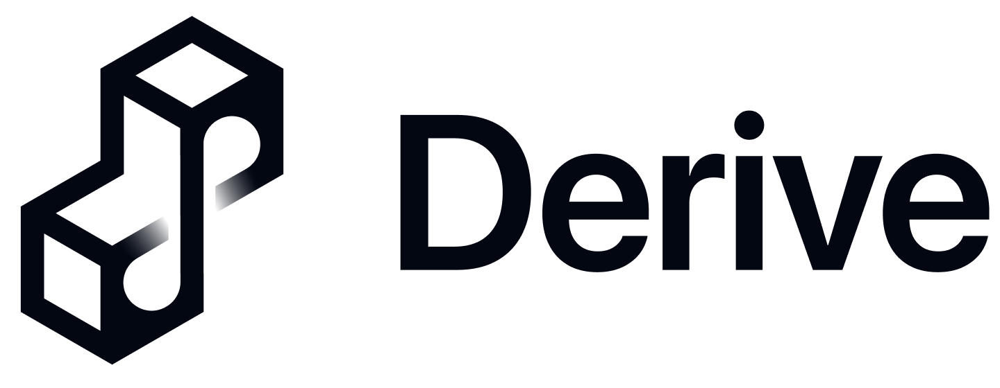
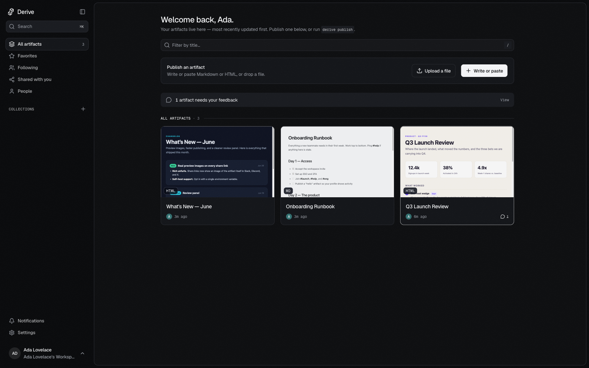
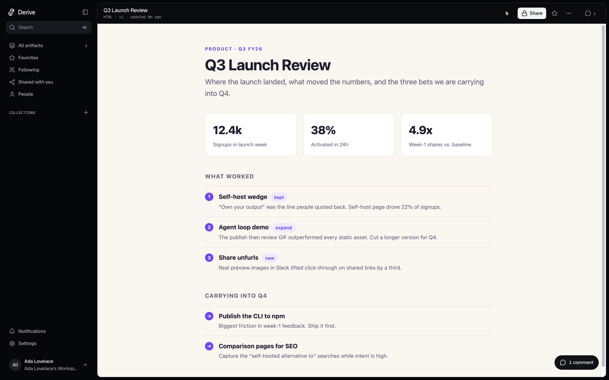
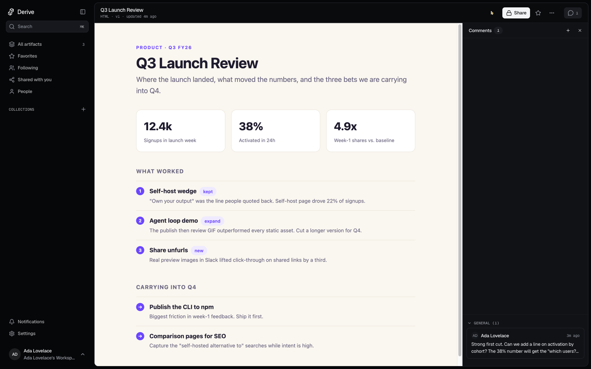

<p align="center">
  <picture>
    <source media="(prefers-color-scheme: dark)" srcset="docs/assets/readme/wordmark-on-dark.png">
    
  </picture>
</p>

<h1 align="center">Publish, review, and own your AI artifacts.</h1>

<p align="center">
Permanent versioned URLs and a review loop your team and its agents share, on infrastructure you control. Hosted, or one self-hosted container.
</p>

<p align="center">
  <a href="https://derive.to"><b>Try free</b></a>
  &nbsp;·&nbsp;
  <a href="#get-started">Self-host</a>
  &nbsp;·&nbsp;
  <a href="STANDARD.md">Docs</a>
</p>

<p align="center">
  <a href="LICENSE"></a>
  <a href="https://www.npmjs.com/package/@derive-to/cli"></a>
  <a href="https://www.npmjs.com/package/@derive-to/mcp"></a>
</p>

<p align="center">
  
</p>

## What is Derive

Derive gives any static artifact, an HTML page, a Markdown doc, or a whole built site, a permanent URL with version history. Publish it from the CLI, the HTTP API, or an agent over MCP. View it rendered inside a sandboxed iframe. Share it with your team, gather comments pinned to the exact text, and approve revisions in a review loop that people and agents run together.

And the context travels with the work. Every artifact carries its content, its versions, and every review comment, so the context stays alive as it moves between people and tools. That kept context is what makes Derive model-agnostic: keep collaborating by hand or with your model of choice, and hand off without losing the thread, because the source of truth lives with the document, not inside any one AI chat.

The point is ownership. Unlike hosted-only tools for sharing AI output, Derive is fair source and self-hostable: run the whole product as one container on your own infrastructure, or use the hosted app. Your artifacts, your data, your URL.

## Features

<table>
<tr>
<td width="52%" valign="top">
  
</td>
<td valign="top">

### Publish anything, get a permanent URL

HTML, Markdown, or a whole built site. Every revision is a new version at the same URL, so a link you shared last week still resolves, and still shows its history.

</td>
</tr>
</table>

<table>
<tr>
<td valign="top">

### A review loop your team and its agents share

Share an artifact and @mention the people who should weigh in. Comments pin to the exact text; approve a version or request changes. Agents drive the same loop over MCP: publish a draft, read the feedback, revise, resolve.

</td>
<td width="52%" valign="top">
  
</td>
</tr>
</table>

<table>
<tr>
<td width="52%" valign="top">
  
</td>
<td valign="top">

### One library for everything you've shipped

Every artifact you publish lands in one library with a live preview, sorted the way you work: favorites, shared with you, and collections. It lives on your own infrastructure or the hosted app, so the work you own stays in one place, not scattered across chat threads.

</td>
</tr>
</table>

Also included:

- ✅ **Kept context, model-agnostic.** Content, versions, and feedback travel with the artifact (not locked in one AI chat), so any teammate or model can pick the work up.
- ✅ **Sandboxed viewer.** Every artifact runs on an opaque origin, isolated from cookies and other artifacts.
- ✅ **Self-host your way.** SQLite and local disk by default, or Postgres and S3/R2 at scale.
- ✅ **Real-time collaboration.** Comments, approvals, and who-else-is-here presence stream live over Server-Sent Events.
- ✅ **Rich share unfurls.** Every share link unfurls as a card in Slack, Discord, X, and Notion, showing the artifact itself, not a generic placeholder.
- ✅ **CLI-first.** Scaffold and publish from the terminal.
- ✅ **Remote MCP server.** Connect any agent with one command.
- ✅ **Visibility controls.** Private, org, or public, with an optional password to lock public links.

## Get started

<a id="get-started"></a>

<table>
<tr>
<td width="50%" valign="top">

### ☁️ Hosted (free)

The fastest path. No install.

1. Go to [derive.to](https://derive.to)
2. Create an account
3. Publish your first artifact

You get a library, in-browser publishing, and the comment loop in about a minute.

</td>
<td width="50%" valign="top">

### 🖥️ Self-host

One container is the whole product.

```bash
docker compose -f deploy/compose.yml up -d
# → http://localhost:8080
```

API and web, sign-in, publishing, comments, and the sandboxed viewer, with SQLite and blobs in one volume. See [DEPLOY.md](DEPLOY.md) for Postgres, S3/R2, and cloud hosts.

</td>
</tr>
</table>

### From the terminal

```bash
npm i -g @derive-to/cli
derive init my-doc --template slides   # templates: md · html · slides
cd my-doc
derive publish                         # versioned URL; the id is saved to derive.json
```

### Connect an agent (MCP)

```bash
# Derive is a remote MCP server (OAuth). Connect either client:
claude mcp add --transport http --scope project derive https://derive.to/mcp
codex mcp add derive --url https://derive.to/mcp

# or run a local stdio server (set DERIVE_SERVER; DERIVE_TOKEN for a static bearer):
npx -y @derive-to/mcp
```

The agent acts at the role you grant: publish access publishes directly; a lower scope reads and proposes. Full loop in [packages/mcp/SKILL.md](packages/mcp/SKILL.md).

## Agents: ship a page, get the review comments back

Derive is built for the loop where an agent publishes and a human (or another agent) reviews. `derive init` scaffolds one canonical `derive` skill into the native Codex and Claude locations (`.agents/skills/derive` and `.claude/skills/derive`) plus each client's project MCP config. For an existing repo, run `derive agent setup`. The skill declares its MCP dependency for Codex and routes either client into the matching `derive://skills/*` workflow before it acts.

The core MCP tools: `find` (search + browse artifacts and contexts), `read` (content), `catch_up` (what changed, open feedback, version history, and — with no id — your work queue), `comment` (leave, reply, resolve), `publish` (save a revision), and `stage` (upload a big document or an image/font out-of-band). `publish` goes live if your role can publish; otherwise, or with `for_review: true`, it files a proposal a human approves.

## How it works

One Node container is the whole product; storage is pluggable behind interfaces. The same image self-hosts on SQLite and local disk, scales on Postgres and S3/R2, or runs on Cloudflare Workers.

```
apps/api          HTTP API, sandboxed artifact serving, viewer
apps/web          web UI (TanStack Start, SPA mode, static bundle)
packages/core     domain: ports, publish, markdown render, viewer shell
packages/db       MetaStore: sqlite (default) · postgres · d1
packages/storage  BlobStore: fs (default) · s3/r2
packages/cli      derive init (md/html/slides) · derive publish <file|dir>
packages/mcp      Local compatibility MCP: eight agent tools + derive://guide
```

Every artifact ships OG and Twitter meta plus an oEmbed document, serves a live Server-Sent Events stream, and renders under a strict sandbox CSP on an opaque origin. See [STANDARD.md](STANDARD.md) for the authoring and embed details.

## Deploy

The single-container image runs on any host with a persistent volume.

[](https://railway.com/new)
&nbsp;&nbsp;
[](DEPLOY.md)

- **Railway:** New Project → Deploy from GitHub repo → this repo. Add a Volume mounted at `/data` so SQLite and blobs persist, or attach Railway Postgres and set `DATABASE_URL`.
- **Fly.io:** `fly launch --config deploy/fly.toml --dockerfile deploy/Dockerfile`, then `fly deploy`.

Both auto-detect their assigned URL for auth cookies and share links; set `BASE_URL` only for a custom domain. Full guide: [DEPLOY.md](DEPLOY.md).

## License

[Functional Source License (FSL-1.1-ALv2)](LICENSE), fair source. Run, modify, and self-host Derive freely for any purpose except offering it as a competing commercial product or service. Each release automatically converts to Apache-2.0 two years after it ships.
